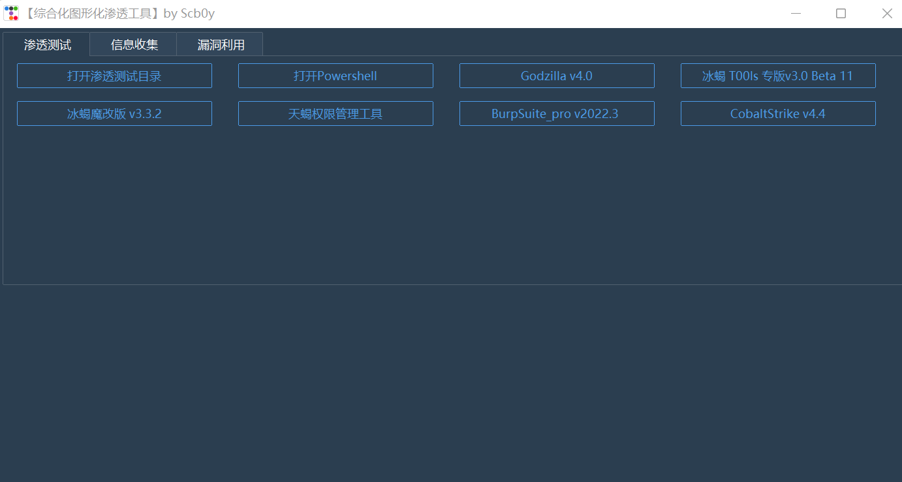
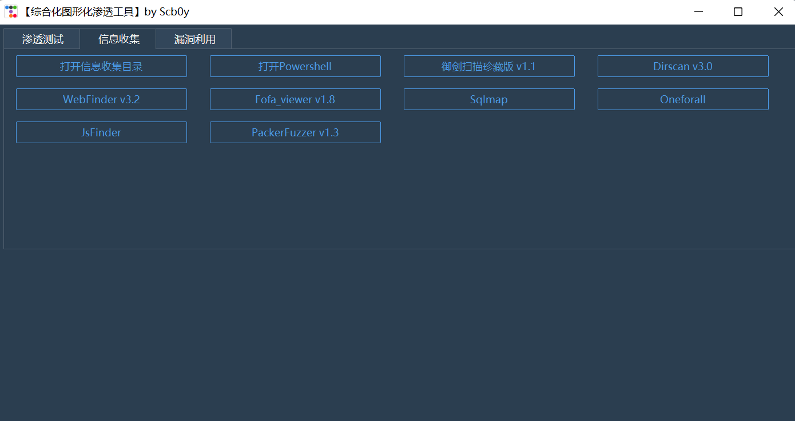
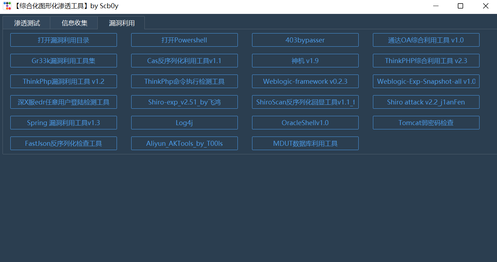
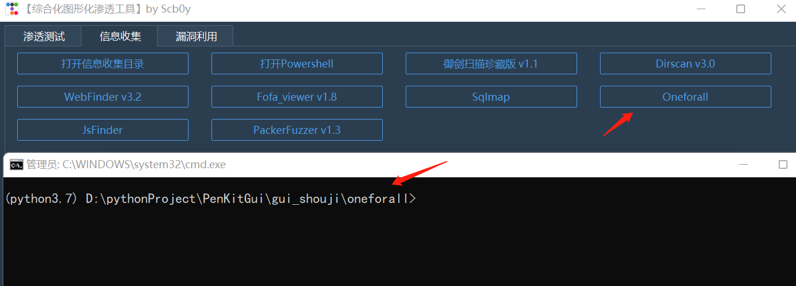
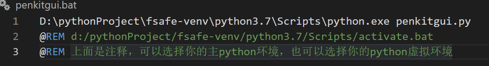
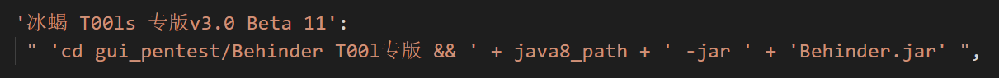
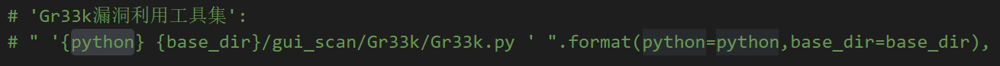
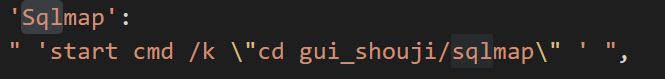

## 前言

作为一个脚本小子，自然是有很多渗透工具，如果有一个工具箱能把这些工具集成到一个 UI 上，无疑能够提高我们的工作效率。

也看过几个类似于本项目的工具，都是把工具集成到 UI 界面上，使用的是 Python 的 Wxpy 模块做的，在使用了一段时间后，发现如果自己要添加工具，更新迭代或者移除工具的话，不太方便，需要修改多个地方，不利于自己拓展。

所以就有了本项目，PenKitGui，一个渗透测试工具箱，你可以用它来 DIY 你自己的渗透工具武器库😎。

这个工具有几个优点：拓展性好，方便修改，适合命令行工具。

工具箱里面附带的工具，为作者在网络上收集而来，不保证安全性。
分享链接：https://www.123pan.com/s/gHUDVv-tKsG3 提取码:8888

## 原理

`codeBuild.py`  通过读取 `settings.py` 里的数据，自动生成 `penkitgui.py` 和 `penkit.py` 。如果修改了 `settings.py` ,运行一下 `codeBuild.py` 即可更新 `penkitgui.py` 和 `penkit.py`。

## Detail

项目目录结构：

```
├── gui_pentest
├── gui_scan
├── gui_shouji
├── imgs
├── Java_path
├── codedBuild.py
├── penkit.py
├── penkitgui.bat
├── penkitgui.py
├── penkitgui.vbs
├── README.MD
├── requirements.txt
└── setting.py
```

使用 `ttkibootstrap` 构建










## 如何使用

克隆本项目到本地：

```
git clone git@github.com:ccc-f/PenKitGui.git
```

修改`penkitgui.bat`里面的 python 环境为你自己的（也可以选择虚拟环境），比如：

```
python3 penkitgui.py
```



安装依赖包：

```
pip install -r requirements.txt
```

**非Debug模式运行**

直接双击 `penkitgui.vbs`

**Debug模式运行**

直接双击 `penkitgui.bat`

## 如何DIY

`setting.py` 文件：

参数如下：

```
# 设置 Python 路径
# python = 'D:\pythonProject\fsafe-venv\python3.7\Scripts\python.exe'
python = 'python3'
# 主题选择
themes = 'superhero'
# 每行工具按钮数量
line_count = 4
# UI 宽度
width = 1400
# UI 高度
height = 700
# 按钮宽度
button_width = 25
# 工具添加
tools = {
'f1名称':{
	'工具名称':
	"需要执行的命令",
	'2':
	"2",
},
'选项卡2名称':{
	'工具名称':
	"需要执行的命令",
	'':
	"cmd",
},
}
```

如果添加的是 java 工具，命令格式如下：

```
'cd gui_pentest/工具目录 && ' + java8_path + ' -jar ' + '工具名称.jar'
```



如果添加的是 python 工具，格式如下：

```
" '{python} {base_dir}/gui_scan/Gr33k/Gr33k.py ' ".format(python=python,base_dir=base_dir),
```



如果需要打开 cmd 命令行，格式如下：

```
'start cmd /k \"cd gui_shouji/sqlmap\" '
```



## 免责声明

```
本工具仅面向合法授权的企业安全建设行为，在使用本工具进行检测时，您应确保该行为符合当地的法律法规，并且已经取得了足够的授权。  

如您在使用本工具的过程中存在任何非法行为，您需自行承担相应后果，我们将不承担任何法律及连带责任。 

在使用本工具前，请您务必审慎阅读、充分理解各条款内容，限制、免责条款或者其他涉及您重大权益的条款可能会以加粗、加下划线等形式提示您重点注意。 除非您已充分阅读、完全理解并接受本协议所有条款，否则，请您不要使用本工具。

您的使用行为或者您以其他任何明示或者默示方式表示接受本协议的，即视为您已阅读并同意本协议的约束。 
```

## 参考

https://github.com/ghealer/GUI_Tools

https://mp.weixin.qq.com/s/rNqSfMNTYzJciNEjyY5_Rg


